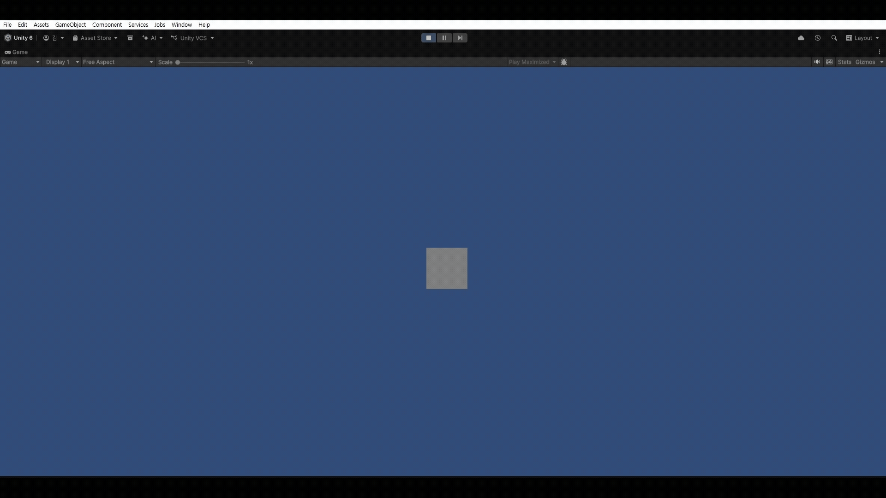
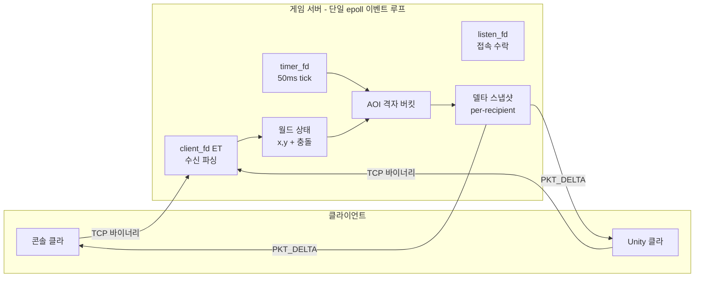

# game-server

- 실시간 멀티플레이어 게임 서버 코어 (C++ / Linux epoll)
- server-authoritative 2D 실시간 게임 서버와 콘솔·Unity 클라이언트

## 데모


## 기술 스택
- C++17, Linux (epoll, timerfd)
- 바이너리 TCP 프로토콜
- 클라이언트: 콘솔(C++), Unity(C#) - [game-client-unity](https://github.com/myandue/game-client-unity)

## 아키텍처


## 주요 기능
- **Server-authoritative**: 클라는 입력(의도)만 전송. 위치·규칙은 서버가 계산·강제.
- **Binary Protocol**: `[length][type][payload]`. 길이 접두사 프레이밍. 빅엔디안.
- **epoll ET + non-blocking**: 다중 접속 이벤트 처리. drain 루프.
- **고정 timestep(50ms tick)**: timerfd로 시뮬레이션 루프.
- **충돌 처리**: 이미 점유되어 있는 포지션으로의 이동 거부.
- **AOI(관심 영역) + 격자 bucket**: 수신자의 주변 정보만 전송. O(N²) -> O(N).
- **Delta Snapshot**: 변경분(removed/changed)만 전송.

## 설계 결정 & 트레이드오프

### 1. 시뮬레이션(tick) 루프
- 채팅 서버의 경우 이벤트가 들어오면 작동하는 reactive 구조
- 게임 서버의 경우 입력이 없더라도 세계가 흘러가야하는 구조
- 서버 자체 시계(50ms tick)로 세계를 굴리는 simulation 구조로 구현
- 고정 timestep은 공정성·결정성·대역폭 예측을 준다.
- 이벤트를 기다리는 epoll에 timerfd도 함께 물려 "네트워크 이벤트(listen_fd, client_fd)"와 "시간 이벤트(timer_fd)" 두 시계를 하나의 이벤트 루프에 공존시켰다.

### 2. Binary Protocol
- 좌표·타입 같은 숫자를 텍스트로 보내면 파싱 비용·크기가 크고, 페이로드에 구분자(`\n`)와 같은 바이트가 섞이면 프레임이 깨진다.
- `[length][type][payload]` **길이 접두사 프레이밍 + 빅엔디안**으로 아무 바이트나 안전하게 실어 보낸다.
- 이런 규격에 대한 정책은 클라이언트와 서버 사이에 정확히 공유되어야 한다.

### 3. AOI + 격자 버킷 + Delta Snapshot
- 매 tick마다 모든 플레이어에게 전 세계에 대한 스냅샷을 보내면 O(N²) 대역폭이라 규모가 커지게 되면 버티지 못한다.
- **AOI(관심 영역)**로 각 플레이어의 주변만을 전송한다.
    - 그 또한, 각 플레이어의 주변에 누가 있는지 체크하기 위해 전 세계를 탐색한다면 여전히 O(N²)이다. 그래서 **격자 버킷**을 도입한다.
    - 세계를 일정 사이즈의 격자로 구분한 뒤, 그 안에 플레이어가 들어가 있는 형태이다. 플레이어에게 다른 플레이어의 위치를 보내기 위해 해당 플레이어의 주변 격자만을 탐색한다. 그렇게 복잡도를 O(N²) -> O(N) 으로 줄일 수 있다.
- 특정 플레이어에게 전송한 주변 플레이어 정보를 `last_sent`로 보관하여, 다음 tick에서 `last_sent`와 달라진 부분에 대해서만 전송한다.
    - 이는, 메모리·CPU를 써서 대역폭을 아끼는 맞바꿈이다. 
    - 대역폭이 병목이 되는 경우에는 이와 같은 방식을 적용하는 것이 맞지만, 대부분 변경이 발생해 `last_sent`와의 delta를 계산하는게 무의미할 경우 도입하지 않는 것이 낫다.
    - delta의 발생 여부 및 빈도를 파악해 트레이드오프를 잘 판단해내는 것이 중요한 부분인 것 같다.

### 4. 충돌
- 플레이어의 이동 입력을 받았을 때, 해당 좌표에 이미 다른 플레이어가 존재한다면 **이동 거부(제자리 유지)** 처리한다.

## 빌드 & 실행
```bash
# 서버
g++ -O2 -o game_server src/game_server.cpp
./game_server        # 포트 9000

# 콘솔 클라 (다른 터미널)
g++ -O2 -o client src/client.cpp
./client             # wasd 이동
```

